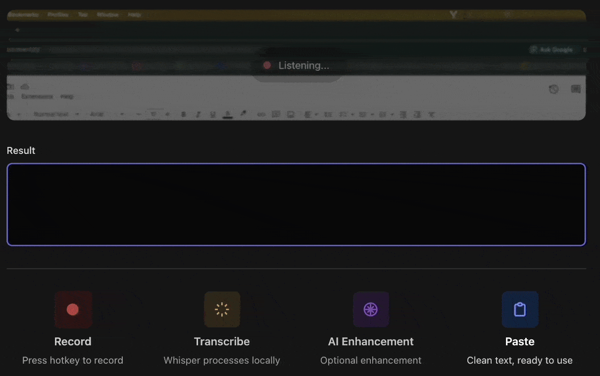

# Vox

Open-source voice-to-text app with local Whisper transcription and AI-powered correction.

[](https://github.com/app-vox/vox/actions/workflows/ci.yml)
[](https://github.com/app-vox/vox/actions/workflows/release.yml)
[](LICENSE)

Hold a keyboard shortcut, speak, and Vox transcribes your voice locally using [whisper.cpp](https://github.com/ggerganov/whisper.cpp), optionally corrects it with AI, and pastes the text into your active app.

## Demo

<div align="center">



</div>

> ⚠️ **Platform Support**
> Vox currently runs on **macOS** (Apple Silicon and Intel). Cross-platform support for Windows and Linux is planned for future releases.

## Table of Contents

- [Quick Start](#quick-start)
- [Features](#features)
- [Requirements](#requirements)
- [Configuration](#configuration)
- [Usage](#usage)
- [Development](#development)
- [Contributing](#contributing)
- [License](#license)

## Quick Start

Download the latest version from the [releases page](https://github.com/app-vox/vox/releases/latest) and drag `Vox.app` to your Applications folder.

### Grant Permissions

Vox needs:
- **Microphone** — for recording (prompted automatically)
- **Accessibility** — for pasting (System Settings > Privacy & Security > Accessibility)

### Configure

1. Open Vox settings from the menu bar icon
2. **Download a Whisper model** (Whisper tab) — `small` recommended (~460 MB)
3. **Setup LLM provider** (LLM tab, optional) — Foundry or AWS Bedrock for text correction

That's it. Hold `Alt+Space` to start recording.

## Features

- **Local transcription** — Powered by whisper.cpp, audio stays on your device
- **AI correction** — Removes filler words and fixes grammar (optional)
- **Hold or toggle modes** — Press-and-hold or toggle recording on/off
- **Auto-paste** — Text appears in your focused app via Cmd+V
- **Multiple models** — Choose speed vs accuracy (tiny to large)
- **Multiple LLM providers** — OpenAI-compatible or AWS Bedrock
- **Menu bar app** — Runs quietly in the background

## Requirements

- **macOS** (Apple Silicon or Intel)
- **LLM provider** (optional) — for text correction:
  - OpenAI-compatible endpoint with API key
  - Or AWS Bedrock credentials with model access

## Configuration

### Whisper Models

Download at least one model from the Whisper tab:

| Model  | Size    | Speed  | Accuracy |
|--------|---------|--------|----------|
| tiny   | ~75 MB  | Fastest| Lower    |
| base   | ~140 MB | Fast   | Decent   |
| small  | ~460 MB | Good   | Good     |
| medium | ~1.5 GB | Slow   | Better   |
| large  | ~3 GB   | Slowest| Best     |

### LLM Provider

**Foundry (OpenAI-compatible)**
- Endpoint URL
- API key
- Model name (e.g., `gpt-4o`)

**AWS Bedrock**
- AWS region
- Credentials (access key, profile, or default chain)
- Model ID (e.g., `anthropic.claude-3-5-sonnet-20241022-v2:0`)

### Shortcuts

Customize keyboard shortcuts in the Shortcuts tab:
- **Hold mode** (default: `Alt+Space`)
- **Toggle mode** (default: `Alt+Shift+Space`)

## Usage

Once configured, Vox runs as a menu bar icon.

Press your shortcut to record. The floating indicator shows:
- **Red** — Recording
- **Yellow** — Transcribing
- **Blue** — Correcting (if LLM enabled)

Release (hold mode) or press again (toggle mode) to stop. Text is pasted automatically.

If correction fails, raw transcription is used. If transcription is empty (silence/noise), nothing is pasted.

## Development

### Setup

```bash
git clone https://github.com/app-vox/vox.git
cd vox
npm install
```

### Run

```bash
npm run dev     # Development with hot reload
npm test        # Run tests
npm run dist    # Build production app
```

Built with Electron, React, TypeScript, and whisper.cpp.

## Contributing

Contributions welcome! To contribute:

1. Fork and create a feature branch
2. Make your changes
3. Run `npm run typecheck && npm run lint && npm test`
4. Commit with [Conventional Commits](https://www.conventionalcommits.org/) (e.g., `feat(audio): add noise gate`)
5. Open a pull request

⚠️ See more details in [CONTRIBUTING.md](CONTRIBUTING.md).

## License

[MIT](LICENSE)
